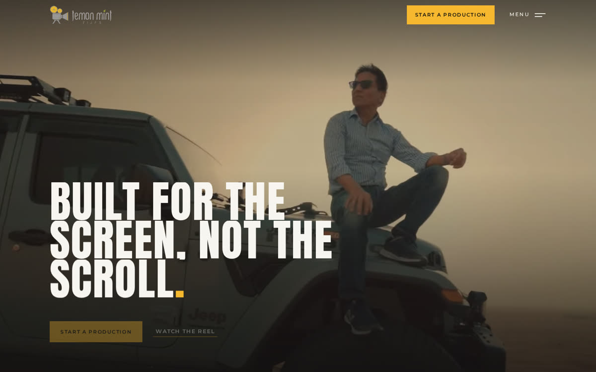

# Lemon Mint Films — static preview

A static build of a custom WordPress theme, published with GitHub Pages so the design can be opened and clicked through without a server.

**Live:** https://polinauspenska.github.io/wp-testsite/



---

## What this is

Lemon Mint Films is a film production house in Dubai. The site is a bespoke WordPress theme — no page builder, no framework, no jQuery — built to the studio's brand system: warm white ground, one lemon action per surface, mint for labels, Anton for headlines and Montserrat for everything else.

What you see here is that theme rendered to flat HTML. The pages, the animation and the styling are the real thing; only WordPress is missing.

### On the page

- **Cinematic preloader** — the camera rolls in, the citrus reels turn, and the mark hands itself over to the header lockup. Vector plus WebGL, and it never redraws the supplied logo.
- **Video hero** with a scroll-scrubbed title entry.
- **Services reel** — nine services wrapped around a 35 mm reel, drawn in WebGL and turned by the scroll.
- **The work wheel** — eight wedges, eight films playing from a single tiled video, and a dive into one of them at full frame.
- **Scroll-pinned sections** — a headline that lights word by word and resolves into rolling counters; client quotes staged as subtitled film frames; a closing call to action built as a film leader counting 3 · 2 · 1.
- **A brief popup** — four short questions with a clapperboard slate that fills itself in as you answer.
- **One-screen contact page** with the studio's details and a map drawn in the brand's own colours.

### Under it

- Custom post types for Projects, Services, Industries, People and Testimonials, each with its own template and schema.
- Everything on the front end is editable through ACF Pro, with the theme's copy as the fallback, so an empty field never leaves a blank page.
- Self-hosted fonts, no tracking, no external requests except the map embed.

## What is not real here

- **The content is placeholder.** Project titles, clients, results and quotes are written to exercise the templates; no real client work is claimed.
- **Nothing sends.** There is no server, so the brief popup and the contact form show their success screen without delivering anything.
- **The admin is missing.** ACF field groups, the demo-content installer and the enquiry handler live in the theme but need WordPress to run.

## Rebuilding

```bash
./build.sh
```

`tools/static-export.php` stands in for WordPress: it provides the core functions the templates call, fills the site with the theme's own demo content, and rewrites every permalink to a `.html` file beside the others, so the whole thing works from the `/wp-testsite/` subfolder. Requires PHP 8 on the command line and nothing else.

```
index.html, about.html, …   the built site (what GitHub Pages serves)
wp-content/                 theme assets, at the paths the markup expects
theme/                      the WordPress theme source
tools/static-export.php     the exporter
build.sh                    rebuild the site from theme/
```

## Installing the real thing

Copy `theme/` into `wp-content/themes/`, activate it, install **ACF Pro**, then run *Tools → Lemon Mint demo content → Install* and save the permalinks once. The theme's own README has the full setup and the editing guide.

---

© Lemon Mint Films. The brand, the logo and the design are the client's; this repository is a technical preview, not a template to reuse.
